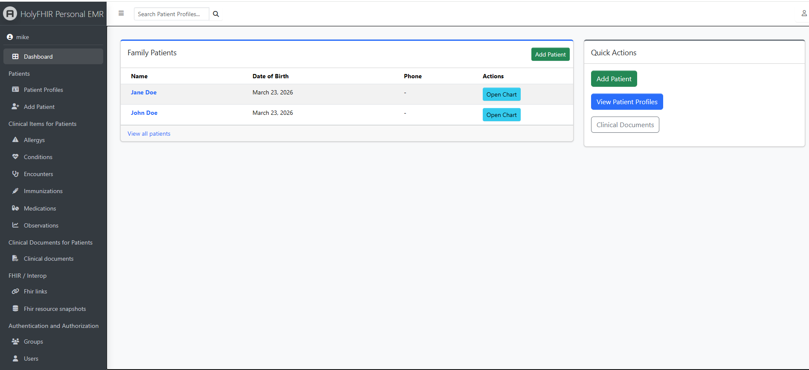

# HolyFHIR – Personal Family EMR

HolyFHIR is a **local-first, personal, small electronic medical record (EMR)** designed for individuals and families.  
It provides a simple, private way to manage health data while supporting **FHIR (Fast Healthcare Interoperability Resources)** for import and export.

Basic profile manipulation is complete, import/export implementation FHIR is next. 

Get in control of YOUR own health data, for free!

---

## ✨ Features

- 👨‍👩‍👧‍👦 **Family-focused patient management**
  - Manage multiple patient profiles (yourself, children, relatives)

- 🏥 **Clinical records**
  - Medications
  - Allergies
  - Conditions
  - Immunizations
  - Observations (labs, vitals)
  - Encounters

- 📄 **Document storage**
  - Upload and manage clinical documents (PDFs, reports, scans)

- 🔄 **FHIR support (in progress)**
  - Import FHIR Bundles and resources
  - Export patient data as FHIR-compliant JSON
  - Snapshot storage of raw FHIR data

- 🖥️ **Local-first architecture**
  - Runs entirely on your machine
  - Uses SQLCipher-encrypted SQLite (no external database required)
  - No cloud dependency

- 🔐 **Privacy-first design**
  - Your data stays on your device
  - No tracking, no external services

---

## 🧱 Tech Stack

- **Backend:** Django
- **Database:** SQLCipher-encrypted SQLite
- **Admin UI:** Django Admin + Jazzmin
- **FHIR Layer:** Custom mapping + resource snapshots
- **Desktop (planned):** Tauri wrapper

---

## 🚀 Getting Started

### 1. Clone the repository

```bash
git clone https://github.com/michaelbdavidson7/holyfhir-personal-family-emr.git
cd holyfhir-personal-family-emr
```
2. Create a virtual environment
```bash
python -m venv venv
source venv/bin/activate   # macOS/Linux
venv\Scripts\activate      # Windows
```
3. Install dependencies
```bash
pip install -r requirements.txt
```
4. Create local development secrets:

```bash
python manage.py bootstrap_secrets
```

This creates `.env` from `.env.example`, generates `DATABASE_ENCRYPTION_KEY`, and generates Django's `SECRET_KEY`.

If `.env` already exists, the command prompts before rewriting it. If you use `--rotate`, it prints a strong warning because changing `DATABASE_ENCRYPTION_KEY` can make an existing encrypted database unreadable without a migration/re-encryption plan. For scripts only, pass `--yes` to skip prompts.

If you prefer to edit `.env` manually, copy the template first:

```powershell
Copy-Item .env.example .env
```

Then replace `DATABASE_ENCRYPTION_KEY` and `SECRET_KEY` with unique strong values.

```powershell
.\venv\Scripts\python -c "import secrets; print(secrets.token_urlsafe(48))"
```

6. Run migrations
```bash
python manage.py migrate
```
7. Create admin user
```bash
python manage.py createsuperuser
```
8. Start the server
```bash
python manage.py runserver
```
9. Open the app

Go to:

 http://127.0.0.1:8000/admin

### Import FHIR data

From the Django Admin, open **FHIR / Interop > Import FHIR Data**, optionally choose an existing patient profile to attach the import to, and upload a MyChart `Requested Record` ZIP export, an NDJSON file, a FHIR JSON Bundle, or a single resource.

The importer currently maps Patient, Condition, AllergyIntolerance, MedicationStatement, MedicationRequest, Immunization, Observation, and Encounter resources into the local EMR models. It also saves each raw resource as a FHIR snapshot for traceability.

### Database Encryption At Rest

Database encryption is always enforced. Django loads `.env` automatically at startup when the file exists. The `.env` file is ignored by Git, and startup fails if it is missing any key listed in `.env.example`.

`sqlcipher3` is the recommended driver because it has current wheel support across Windows, macOS, and Linux. If a specific environment cannot install it cleanly, `pysqlcipher3` remains a legacy fallback, but it usually expects a system `libsqlcipher` install first.

Optional database settings:

- `DJANGO_SETTINGS_MODULE`: Django settings module. Default: `config.settings`
- `DJANGO_ENV_FILE`: environment file to load. Default: `.env`
- `DJANGO_ENV_EXAMPLE_FILE`: environment template used for key validation. Default: `.env.example`
- `SECRET_KEY`: Django secret key. Default: development-only placeholder
- `DEBUG`: enable Django debug mode. Default: `1`
- `ALLOWED_HOSTS`: comma-separated allowed hosts. Default: empty
- `DATABASE_NAME`: encrypted database path. Default: `holyfhir.encrypted.sqlite3`
- `DATABASE_TIMEOUT`: SQLite/SQLCipher connection timeout in seconds. Default: `20.0`
- `DATABASE_ENCRYPTION_KEY`: required SQLCipher encryption key
- `DATABASE_CIPHER_PAGE_SIZE`: SQLCipher page size. Default: `4096`
- `DATABASE_KDF_ITER`: SQLCipher PBKDF iteration count. Default: `256000`
- `DATABASE_CIPHER_COMPATIBILITY`: SQLCipher compatibility mode. Default: `4`

To encrypt an existing plaintext database file:

```bash
python manage.py encrypt_sqlite_db --source db.sqlite3 --target holyfhir.encrypted.sqlite3
```

The command reads the encryption key from `DATABASE_ENCRYPTION_KEY` unless `--key` is supplied directly.


🔄 FHIR Roadmap
 - Import FHIR Bundle (Patient, Medication, Allergy, Condition)
 - Export patient as FHIR Bundle
 - Mapping layer (internal models ↔ FHIR resources)
 - Validation and error reporting
 - SMART on FHIR (future)

🔐 Security Roadmap
 - SQLCipher database encryption
 - OS keychain integration
 - First-run end-user secret generation
 - Store database encryption key in OS secure storage
 - Store Django secret key in OS secure storage or protected app config
 - Encrypted backup and recovery-key export flow
 - Encrypted file storage
 - Secure export handling

🧭 Vision

HolyFHIR aims to become a simple, private, interoperable personal health record system:

Easy enough for individuals and families
Structured enough for real medical use
Compatible with healthcare standards (FHIR)
Fully under user control

⚠️ Disclaimer

This project is for personal use and experimentation.
It is not a certified medical system and should not be relied upon as a sole source of medical truth.

📌 Status

🚧 Early development (Phase 1 complete – core data + admin UI)

📄 License

TBD
